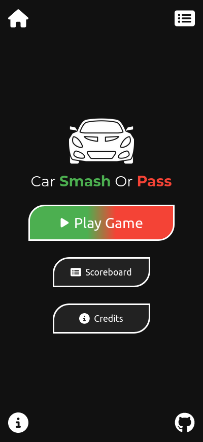
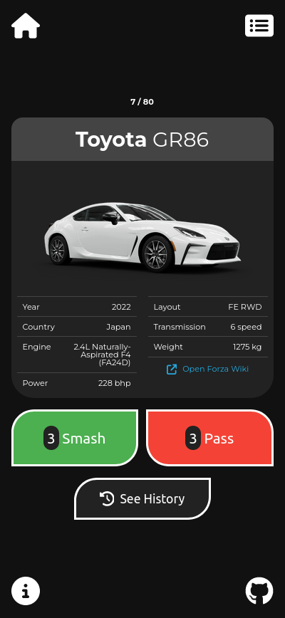
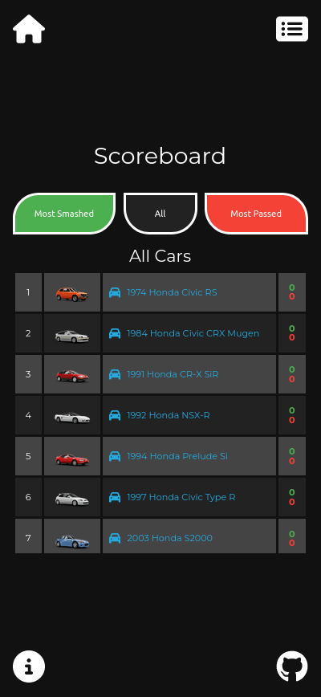
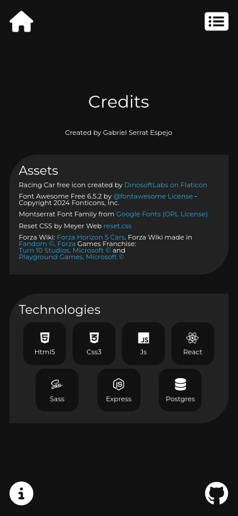

# CarSmashOrPass
Smash or Pass Car Edition. A simple game of choosing your favorite cars. Made with React.

[https://carsmashorpass.vercel.app/](https://carsmashorpass.vercel.app/)

## Description

A web application created with Vite, React, Express and Postgres.

The game consists of voting for cars that you like (smash) or hate (pass).

Car information comes from the Forza Horizon 5 cars page on [Forza Fandom Wiki](https://forza.fandom.com/wiki/Forza_Horizon_5/Cars).

Postgres Database is uploaded in Vercel (Vercel Postgres).

Old implementation of the database was on sqlite (old [cars.db](server/_cars.db) is on server folder).

### Local installation guide

Once the repository folder is downloaded, the application is divided into 2 parts:

- **carsmashorpass** folder (vite + react)
- **server** folder (express + pg)

#### Front-end installation (carsmashorpass folder)

Once inside the folder do the following commands:

`npm install` to install the dependencies.

`npm run dev` to start vite.

You can build vite to production in local with `vite build` or `npm run build`.

#### Back-end installation (server folder)

Once inside the folder do the following commands:

`npm install` to install the dependencies.

`npm start` or `node server.js` to start express.

The variables on server/.env are not included (Production Postgres db).

There is a [placeholder .env](server/.placeholder_env) file for add your db info.

You need to install **postgres** on your local system or do it on a container like **docker**.

### Car list

The car list currently consists of 80 cars from 6 Japanese brands (Honda, Mazda, Mitsubishi, Nissan, Subaru, Toyota):

- [1974 Honda Civic RS](https://forza.fandom.com/wiki/Honda_Civic_RS)
- [1984 Honda Civic CRX Mugen](https://forza.fandom.com/wiki/Honda_Civic_CRX_Mugen)
- [1991 Honda CR-X SiR](https://forza.fandom.com/wiki/Honda_CR-X_SiR)
- [1992 Honda NSX-R](https://forza.fandom.com/wiki/Honda_NSX-R_(1992))
- [1994 Honda Prelude Si](https://forza.fandom.com/wiki/Honda_Prelude_Si)
- [1997 Honda Civic Type R](https://forza.fandom.com/wiki/Honda_Civic_Type_R_(1997))
- [2003 Honda S2000](https://forza.fandom.com/wiki/Honda_S2000)
- [2004 Honda Civic Type R](https://forza.fandom.com/wiki/Honda_Civic_Type-R_(2004))
- [2005 Honda NSX-R](https://forza.fandom.com/wiki/Honda_NSX-R_(2005))
- [2005 Honda NSX-R GT](https://forza.fandom.com/wiki/Honda_NSX-R_GT)
- [2007 Honda Civic Type R](https://forza.fandom.com/wiki/Honda_Civic_Type-R_(2007))
- [2009 Honda S2000 CR](https://forza.fandom.com/wiki/Honda_S2000_CR)
- [2015 Honda Civic Type R](https://forza.fandom.com/wiki/Honda_Civic_Type_R_(2015))
- [2018 Honda Civic Type R](https://forza.fandom.com/wiki/Honda_Civic_Type_R_(2018))
- [1990 Mazda Savanna RX-7](https://forza.fandom.com/wiki/Mazda_Savanna_RX-7)
- [1992 Mazda 323 GT-R](https://forza.fandom.com/wiki/Mazda_323_GT-R)
- [1994 Mazda MX-5 Miata](https://forza.fandom.com/wiki/Mazda_MX-5_Miata_(1994))
- [1997 Mazda RX-7](https://forza.fandom.com/wiki/Mazda_RX-7)
- [2002 Mazda RX-7 Spirit R Type-A](https://forza.fandom.com/wiki/Mazda_RX-7_Spirit_R_Type-A)
- [2005 Mazda Mazdaspeed MX-5](https://forza.fandom.com/wiki/Mazda_Mazdaspeed_MX-5)
- [2011 Mazda RX-8 R3](https://forza.fandom.com/wiki/Mazda_RX-8_R3)
- [2013 Mazda MX-5](https://forza.fandom.com/wiki/Mazda_MX-5_(2013))
- [2016 Mazda MX-5](https://forza.fandom.com/wiki/Mazda_MX-5_(2016))
- [1988 Mitsubishi Starion ESI-R](https://forza.fandom.com/wiki/Mitsubishi_Starion_ESI-R)
- [1992 Mitsubishi Galant VR-4](https://forza.fandom.com/wiki/Mitsubishi_Galant_VR-4)
- [1995 Mitsubishi Eclipse GSX](https://forza.fandom.com/wiki/Mitsubishi_Eclipse_GSX)
- [1997 Mitsubishi GTO (3000GT)](https://forza.fandom.com/wiki/Mitsubishi_GTO)
- [1999 Mitsubishi Lancer Evolution VI GSR](https://forza.fandom.com/wiki/Mitsubishi_Lancer_Evolution_VI_GSR)
- [2004 Mitsubishi Lancer Evolution VIII MR](https://forza.fandom.com/wiki/Mitsubishi_Lancer_Evolution_VIII_MR)
- [2006 Mitsubishi Lancer Evolution IX MR](https://forza.fandom.com/wiki/Mitsubishi_Lancer_Evolution_IX_MR)
- [2008 Mitsubishi Lancer Evolution X GSR](https://forza.fandom.com/wiki/Mitsubishi_Lancer_Evolution_X_GSR)
- [1969 Nissan Fairlady Z 432 (240Z)](https://forza.fandom.com/wiki/Nissan_Fairlady_Z_432)
- [1971 Nissan Skyline 2000GT-R](https://forza.fandom.com/wiki/Nissan_Skyline_2000GT-R)
- [1973 Nissan Skyline H/T 2000GT-R](https://forza.fandom.com/wiki/Nissan_Skyline_H/T_2000GT-R)
- [1987 Nissan Skyline GTS-R (R31)](https://forza.fandom.com/wiki/Nissan_Skyline_GTS-R_(R31))
- [1990 Nissan Pulsar GTI-R](https://forza.fandom.com/wiki/Nissan_Pulsar_GTI-R)
- [1992 Nissan Silvia CLUB K's](https://forza.fandom.com/wiki/Nissan_Silvia_CLUB_K%27s)
- [1993 Nissan 240SX SE](https://forza.fandom.com/wiki/Nissan_240SX_SE)
- [1993 Nissan Skyline GT-R V-Spec](https://forza.fandom.com/wiki/Nissan_Skyline_GT-R_V-Spec_(1993))
- [1994 Nissan Fairlady Z Version S Twin Turbo (300ZX)](https://forza.fandom.com/wiki/Nissan_Fairlady_Z_Version_S_Twin_Turbo)
- [1994 Nissan Silvia K's](https://forza.fandom.com/wiki/Nissan_Silvia_K%27s)
- [1995 Nissan Nismo GT-R LM](https://forza.fandom.com/wiki/Nissan_Nismo_GT-R_LM)
- [1997 Nissan Skyline GT-R V-Spec](https://forza.fandom.com/wiki/Nissan_Skyline_GT-R_V-Spec_(1997))
- [1998 Nissan Silvia K's AERO](https://forza.fandom.com/wiki/Nissan_Silvia_K%27s_AERO)
- [2000 Nissan Silvia Spec-R](https://forza.fandom.com/wiki/Nissan_Silvia_Spec-R)
- [2002 Nissan Skyline GT-R V-Spec II](https://forza.fandom.com/wiki/Nissan_Skyline_GT-R_V-Spec_II)
- [2003 Nissan Fairlady Z (350Z)](https://forza.fandom.com/wiki/Nissan_Fairlady_Z)
- [2010 Nissan 370Z](https://forza.fandom.com/wiki/Nissan_370Z)
- [2010 Nissan Tsuru (Sentra B13)](https://forza.fandom.com/wiki/Nissan_Tsuru)
- [2012 Nissan GT-R Black Edition](https://forza.fandom.com/wiki/Nissan_GT-R_Black_Edition)
- [2017 Nissan GT-R](https://forza.fandom.com/wiki/Nissan_GT-R_(2017))
- [2018 Nissan Sentra Nismo](https://forza.fandom.com/wiki/Nissan_Sentra_Nismo)
- [2019 Nissan 370Z Nismo](https://forza.fandom.com/wiki/Nissan_370Z_Nismo)
- [2020 Nissan GT-R Nismo](https://forza.fandom.com/wiki/Nissan_GT-R_Nismo)
- [2023 Nissan Z (400Z)](https://forza.fandom.com/wiki/Nissan_Z)
- [1990 Subaru Legacy RS](https://forza.fandom.com/wiki/Subaru_Legacy_RS)
- [1998 Subaru Impreza 22B STi](https://forza.fandom.com/wiki/Subaru_Impreza_22B_STi)
- [2004 Subaru Impreza WRX STi](https://forza.fandom.com/wiki/Subaru_Impreza_WRX_STi_(2004))
- [2005 Subaru Impreza WRX STi](https://forza.fandom.com/wiki/Subaru_Impreza_WRX_STi_(2005))
- [2008 Subaru Impreza WRX STI](https://forza.fandom.com/wiki/Subaru_Impreza_WRX_STI_(2008))
- [2011 Subaru WRX STI](https://forza.fandom.com/wiki/Subaru_WRX_STI_(2011))
- [2013 Subaru BRZ](https://forza.fandom.com/wiki/Subaru_BRZ)
- [2015 Subaru WRX STI](https://forza.fandom.com/wiki/Subaru_WRX_STI_(2015))
- [2019 Subaru STI S209](https://forza.fandom.com/wiki/Subaru_STI_S209)
- [2022 Subaru BRZ](https://forza.fandom.com/wiki/Subaru_BRZ_(2022))
- [1965 Toyota Sports 800](https://forza.fandom.com/wiki/Toyota_Sports_800)
- [1969 Toyota 2000GT](https://forza.fandom.com/wiki/Toyota_2000GT)
- [1974 Toyota Celica GT](https://forza.fandom.com/wiki/Toyota_Celica_GT)
- [1985 Toyota Sprinter Trueno GT Apex](https://forza.fandom.com/wiki/Toyota_Sprinter_Trueno_GT_Apex)
- [1989 Toyota MR2 SC](https://forza.fandom.com/wiki/Toyota_MR2_SC)
- [1992 Toyota Celica GT-Four RC ST185](https://forza.fandom.com/wiki/Toyota_Celica_GT-Four_RC_ST185)
- [1992 Toyota Supra 2.0 GT](https://forza.fandom.com/wiki/Toyota_Supra_2.0_GT)
- [1994 Toyota Celica GT-Four ST205](https://forza.fandom.com/wiki/Toyota_Celica_GT-Four_ST205)
- [1995 Toyota MR2 GT](https://forza.fandom.com/wiki/Toyota_MR2_GT)
- [1998 Toyota Supra RZ](https://forza.fandom.com/wiki/Toyota_Supra_RZ)
- [2003 Toyota Celica Sport Specialty II](https://forza.fandom.com/wiki/Toyota_Celica_SS-I)
- [2013 Toyota GT86](https://forza.fandom.com/wiki/Toyota_GT86)
- [2020 Toyota GR Supra](https://forza.fandom.com/wiki/Toyota_GR_Supra)
- [2021 Toyota GR Yaris](https://forza.fandom.com/wiki/Toyota_GR_Yaris)
- [2022 Toyota GR86](https://forza.fandom.com/wiki/Toyota_GR86)

## Pages and components

Page routing has been created with react-router, and the styles of each component created with SASS (scss).

### Header and Footer

Header contains 2 buttons:
- Home: link that returns to the initial screen.
- Scoreboard: link that opens the statistics of all the cars.

Footer contains 2 buttons:
- Credits: link that shows the credits.
- Github: link that opens the CarSmashOrPass repository.

### Home

Home screen with 3 buttons:
- Play Game: start playing the smash or pass game.
- Scoreboard: see a table with the statistics of all the cars.
- Credits: view the game credits.

### Play Game

Game screen with the car card and its information. Below we find 3 buttons:
- Smash: Vote which one you like and move on to the next car.
- Pass: Vote what you don't like and move on to the next car.
- See History: show a table with the last voted cars.

#### See History

Show a table with the last voted cars. Shows whether Smash (S) or Pass (P) has been voted. The text contains a link to the car's Forza Wiki.

### Scoreboard

Shows 3 types of tables:
- Most Smahed: table ordered by the cars most voted as Smash.
- Most Passed: table ordered by the cars most voted as Pass.
- All Cars: table sorted by car brand, year and car model.

When you click on a car name, it shows the full car card.

#### Car Card

It shows only a car card just like in the Play Game component.

### Credits

Credits screen showing the assets and technologies used.

## Next ideas to implement

These are some ideas to implement in the near future (I hope):

- Add the game icon car, it is a [Lotus Exige that is in Forza Horizon 5](https://forza.fandom.com/wiki/Lotus_Exige_S), but I should add more cars from other countries before (not just Japanese).
- Add more cars in general, I would like to add as many as possible, but due to limitations of not making my own database so large and using external APIs.
- Be able to switch between dark and light theme.
- Add some type of extra sound or animation.

## Credits (assets and technologies)

A simple game created by Gabriel Serrat Espejo ([gabriser GitHub](https://github.com/gabriser)).

### Assets

- Racing Car (Lotus Exige) free icon created by [DinosoftLabs on Flaticon](https://www.flaticon.com/free-icon/racing-car_4745016).
- Car Tire free icon created by [Freepik on Flaticon](https://www.flaticon.es/icono-gratis/llanta-de-carro_5266107).
- Font Awesome Free 6.5.2 by [@fontawesome License](https://fontawesome.com/) - Copyright 2024 Fonticons, Inc.
- [Montserrat Font Family from Google Fonts (OPL License)](https://fonts.google.com/specimen/Montserrat/about?query=montserrat)
- [Reset CSS by Meyer Web](https://meyerweb.com/eric/tools/css/reset/reset.css)
- Forza Wiki: [Forza Horizon 5 Cars](https://forza.fandom.com/wiki/Forza_Horizon_5/Cars). Forza Wiki made in [Fandom](https://fandom.com/).
- [Forza](https://forza.net/) Games Franchise: [Turn 10 Studios](https://www.turn10studios.com/), [Playground Games](https://playground-games.com/) and Microsoft.

### Technologies

- Vite: [vitejs.dev](https://vitejs.dev/), [npmjs.com (vite)](https://www.npmjs.com/package/vite)
- React: [react.dev](https://react.dev/), [npmjs.com (react)](https://www.npmjs.com/package/react)
- React Router: [reactrouter.com](https://reactrouter.com/), [npmjs.com (react-router-dom)](https://www.npmjs.com/package/react-router-dom)
- Sass: [sass-lang.com](https://sass-lang.com/), [npmjs.com (sass)](https://www.npmjs.com/package/sass)
- Express: [expressjs.com](http://expressjs.com/), [npmjs.com (express)](https://www.npmjs.com/package/express)
- Postgres: [www.postgresql.org](https://www.postgresql.org/), [Vercel Postgres](https://vercel.com/storage/postgres), [npmjs.com (pg)](https://www.npmjs.com/package/pg)